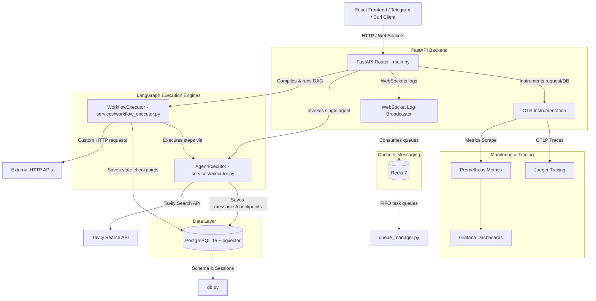

# Technical Architecture — AI Agent Orchestration Platform

This document describes the high-level system architecture, component relations, data flows, and technologies used in the AI Agent Orchestration Platform.

---

## 1. System Architecture Overview

The platform is designed as a modular, containerized multi-agent orchestration engine. It enables users to construct single agents with tool-calling capabilities and chain them together into complex, multi-agent Directed Acyclic Graph (DAG) workflows.

---

## 2. Component breakdown

### 2.1. Frontend Client
* **Tech Stack**: React, Vite, TypeScript, Tailwind CSS, Vis.js/ReactFlow (for Workflow Builder canvas).
* **Role**: Provides a modern, rich user interface to:
  * Register and customize agents (configuring system prompts, LLM providers, temperatures, memory limits, and Tavily search).
  * Design workflow diagrams using a drag-and-drop node graph canvas.
  * Trigger executions and watch real-time node handoffs and trace logs.
  * Inspect comprehensive execution history, including tokens consumed, costs, and intermediate node outputs.

### 2.2. FastAPI HTTP API
* **Tech Stack**: FastAPI, Pydantic V2, Uvicorn, Python 3.11.
* **Role**: Serves REST endpoints for agents, workflows, tools, and stats:
  * Coordinates background execution threads to run workflow state machines asynchronously.
  * Hosts WebSocket/SSE channels to broadcast real-time server and LLM trace logs to the UI.
  * Acts as a webhook receiver for Telegram messenger integration.

### 2.3. Dynamic LangGraph Engines
* **Single-Agent Executor**:
  * Dynamically compiles a state machine for a specific agent.
  * If the agent has `web_search` enabled, LangGraph compiles a two-node graph: `tool` (Tavily search) → `llm` (generates response based on search results) → `END`.
  * Incorporates conversation memory (sliding-window buffer limit) by loading historical agent/user messages from PostgreSQL.
* **Multi-Agent Workflow Executor**:
  * Translates the JSON canvas DAG schema (nodes and edges) into a compiled LangGraph `StateGraph` dynamically at runtime.
  * Maps `AGENT` nodes to the single-agent execution engine, saving step-by-step progress checkpoints.
  * Maps `TOOL` nodes to custom HTTP request tasks, executing external APIs inline.
  * Wires conditional edges (`graph.add_conditional_edges`) using evaluated routing expressions (e.g. `equals`, `contains`, `not_equals`) matched against the previous node's output.

### 2.4. Data & State Storage (PostgreSQL)
* **Tech Stack**: PostgreSQL 15 + `pgvector` extension.
* **Role**: Persists persistent structured data:
  * **Config Store**: Tables for `agents`, `workflows`, and `tools`.
  * **Transaction History**: `messages` (agent conversation histories) and `workflow_executions` (metadata, total cost, execution time, and `node_outputs` JSON mapping).
  * **Workflow Checkpoints**: `workflow_execution_checkpoints` logs state transitions at each individual canvas step to allow session state debugging.

### 2.5. Cache & Messaging (Redis)
* **Tech Stack**: Redis 7 (Alpine).
* **Role**: Operates as a task queue, log caching layer, and pub/sub transport for async task execution.

---

## 3. Core Execution Flow

The sequence diagram below details how a multi-agent workflow gets triggered, compiled, executed, and tracked:

```mermaid
sequenceDiagram
    autonumber
    actor User as UI / Web Client
    participant API as FastAPI Backend
    participant WF as WorkflowExecutor
    participant AG as AgentExecutor
    participant DB as PostgreSQL
    participant TV as Tavily / LLM API
    participant JS as Jaeger / Prometheus

    User->>API: POST /workflows/{id}/execute (task description)
    Note over API: Create queued execution record
    API-->>User: 202 Accepted (execution_id, status="queued")
    
    rect rgb(30, 30, 40)
        Note over API: Start background execution task
        API->>WF: execute(workflow_id, task, execution_id)
        WF->>DB: Fetch workflow definition DAG
        DB-->>WF: JSON definition (nodes & edges)
        WF->>WF: Compile LangGraph StateGraph dynamically
        
        loop For each Agent Node in graph
            WF->>AG: execute(agent_id, current_input)
            AG->>DB: Fetch agent prompt, memory history
            DB-->>AG: Agent config & history list
            
            opt Has Web Search Tool
                AG->>TV: Request Tavily Search API
                TV-->>AG: Context search results
            end
            
            AG->>TV: Request LLM Completion (OpenAI/Groq/OpenRouter)
            TV-->>AG: Completion response text
            
            AG->>DB: Save response MessageORM (history)
            AG-->>WF: Return node result, token usage, cost
            WF->>DB: Save step progress checkpoint
        end
        
        WF->>DB: Update execution status="success" & node_outputs
        WF->>JS: Ship trace spans & record metrics
    end
```

---

## 4. Observability and Monitoring

The orchestration engine includes built-in enterprise-grade observability:
1. **Distributed Tracing (Jaeger)**: Every execution runs within an OpenTelemetry span context. API HTTP requests, database transactions, tool invocations, and individual agent executions are linked to a single `trace_id` propagated across containers.
2. **Metrics Collection (Prometheus)**: Exposes a `/metrics` scrape endpoint. Tracks execution counts, cost aggregates, model latencies, and token counters.
3. **Dashboards (Grafana)**: Provisions visual tracking dashboards connected to Prometheus. Allows live tracking of active execution rates, error percentages, and model usage patterns.
