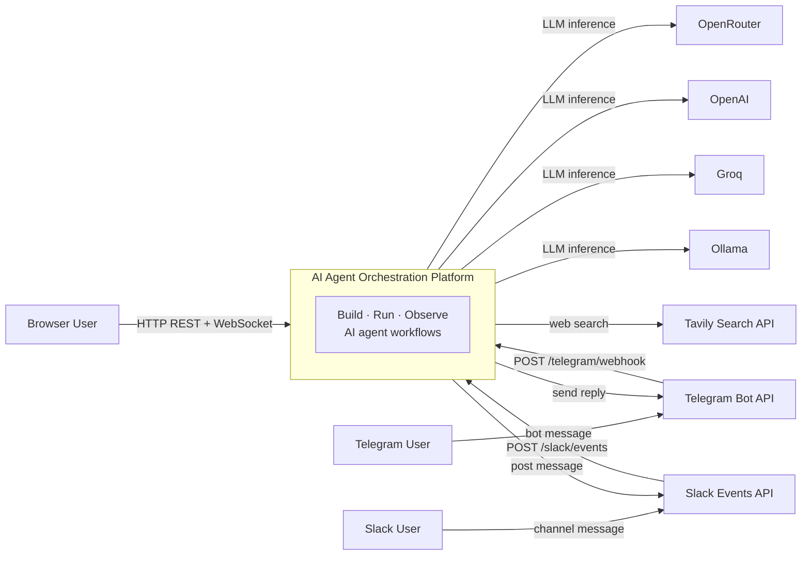
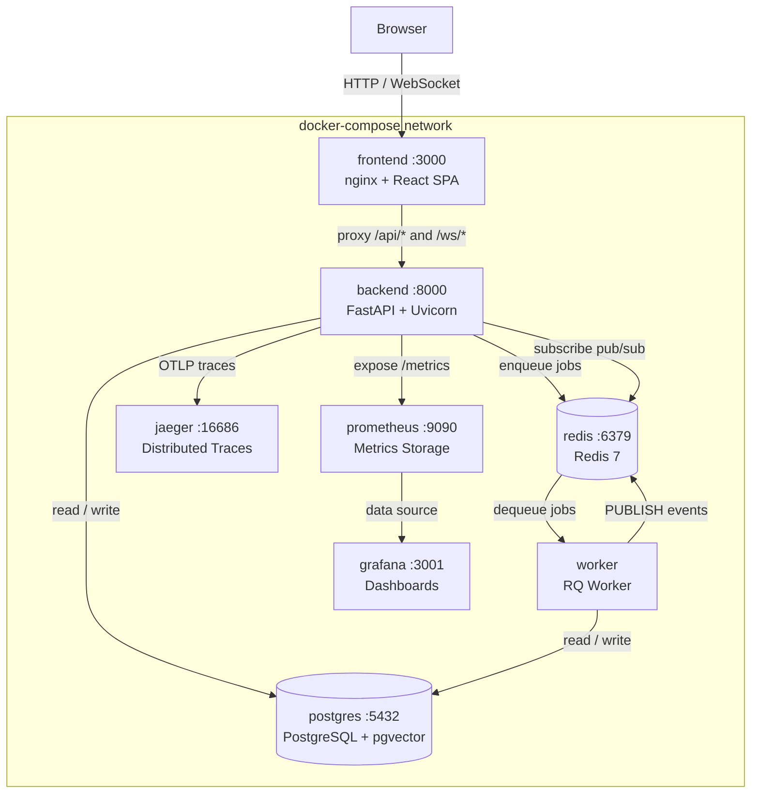
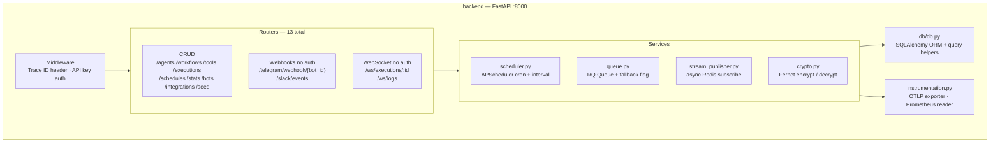
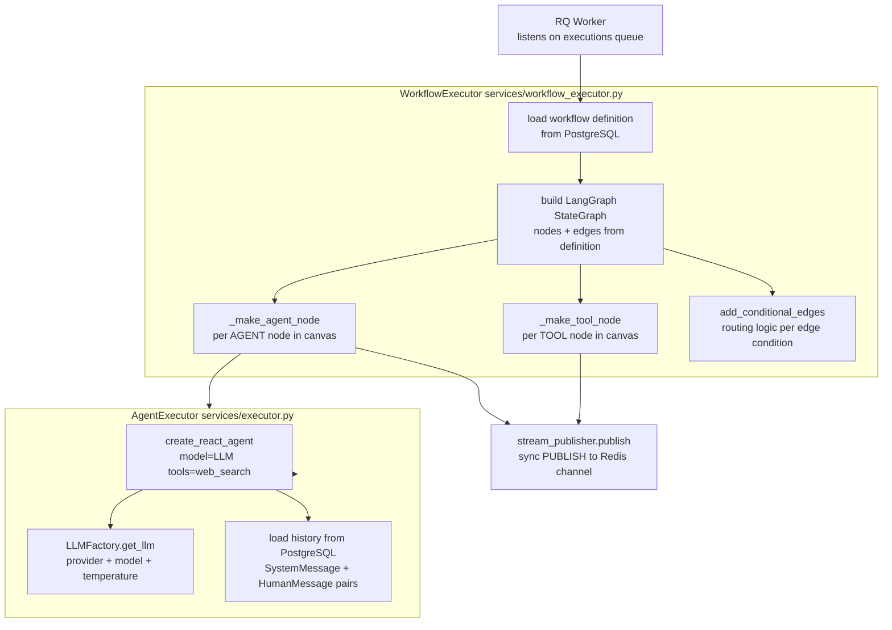
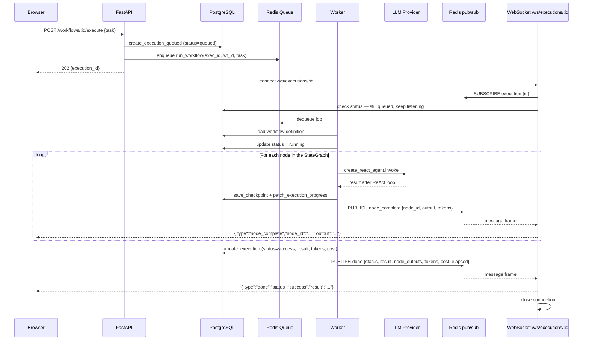
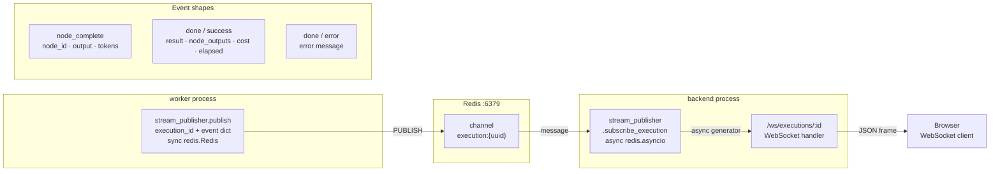
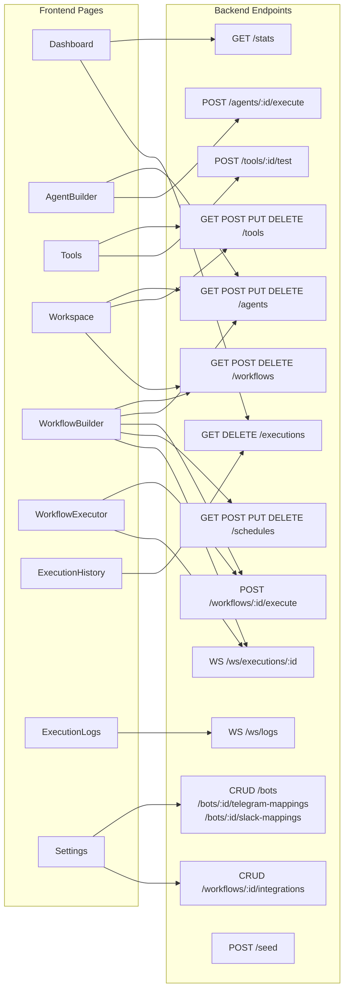
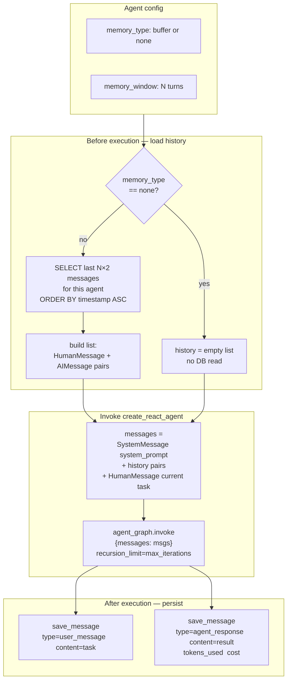
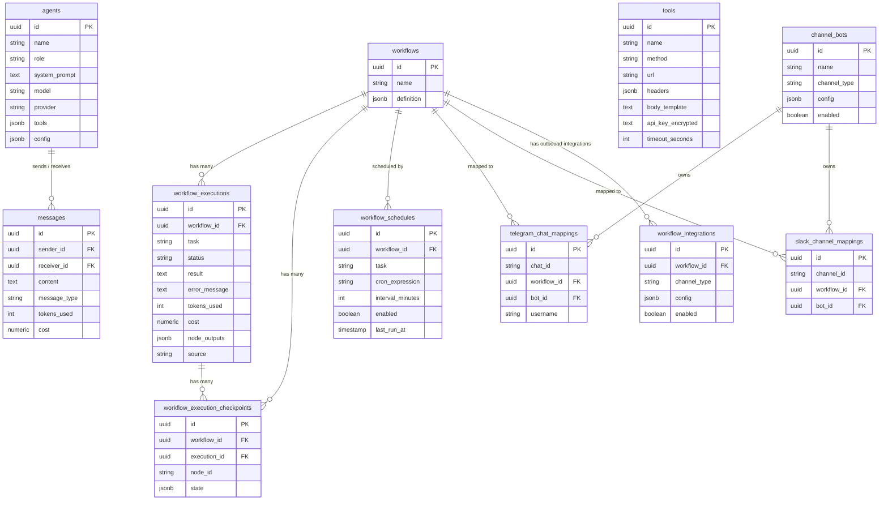

# System Architecture — AI Agent Orchestration Platform

Structured as four C4 levels: Context → Containers → Components → Key Flows.
Each diagram covers one topic and stays under 20 nodes.

---

## Level 1 — System Context

Who uses the platform and what external systems it depends on.

---

## Level 2 — Container Map

Eight Docker containers and their primary connections.

---

## Level 3 — Backend Components

What lives inside the `backend` container.

---

## Level 3 — Worker Components

What the `worker` container does when it picks up a job.

---

## Execution Lifecycle

Full journey from browser click to result displayed.

---

## Real-Time Streaming

How events travel from worker to browser without polling.

**Race-condition safety:** The WebSocket handler subscribes to Redis *before* checking the DB. If the worker finishes between those two steps, the `done` event is still received. If Redis is unavailable, the handler falls back to a final DB read.

---

## Frontend → API Map

Which UI page calls which backend endpoint.

---

## Conversation Memory Flow

How agent history is loaded before and saved after each execution.

---

## Error & Retry Flow

What happens when a node fails or Redis is unavailable.

```mermaid
graph TD
    START2["Workflow execution starts"]

    subgraph NODE_FAIL["Node-level failure"]
        N_ERR["exception inside agent node\nor tool node"]
        LOG_ERR["log exception\nspan.record_exception"]
        UPDATE_ERR["update_execution\nstatus=error\nerror_message=str exc"]
        PUB_ERR["stream_publisher.publish\ntype=done  status=error"]
        N_ERR --> LOG_ERR --> UPDATE_ERR --> PUB_ERR
    end

    subgraph JOB_RETRY["Job-level retry — RQ"]
        JOB_FAIL["job raises exception"]
        REQUEUE["RQ re-enqueues job\nRetry max=3\nintervals: 10s → 30s → 60s"]
        FAILED_Q["after 3 failures\njob moves to failed queue\nno more retries"]
        JOB_FAIL --> REQUEUE --> FAILED_Q
    end

    subgraph NO_REDIS["Redis unavailable — graceful fallback"]
        QFLAG["QUEUE_AVAILABLE = False\nqueue.py on startup ping fails"]
        BG_TASK["execution_queue = None\nuse FastAPI BackgroundTasks"]
        POLL["frontend polls\nGET /executions/:id every 2s\ninstead of WebSocket"]
        QFLAG --> BG_TASK --> POLL
    end

    START2 --> NODE_FAIL
    START2 --> JOB_RETRY
    START2 --> NO_REDIS
```

---

## Database Schema

All nine tables and their foreign-key relationships.

---

## Ports Reference

| Container | Internal port | Host port | Protocol | Purpose |
|---|---|---|---|---|
| frontend | 3000 | **3000** | HTTP | React SPA + nginx proxy |
| backend | 8000 | **8000** | HTTP + WS | FastAPI REST + WebSocket |
| postgres | 5432 | 5432 | TCP | PostgreSQL database |
| redis | 6379 | 6379 | TCP | RQ task queue + pub/sub |
| jaeger | 16686 | **16686** | HTTP | Jaeger trace UI |
| jaeger | 4318 | 4318 | HTTP | OTLP trace receiver |
| prometheus | 9090 | **9090** | HTTP | Metrics query + storage |
| grafana | 3000 | **3001** | HTTP | Dashboard UI |
| worker | — | — | — | No exposed port (internal only) |

**Bold** = ports you open in a browser.
