# Tool Architecture — AI Agent Orchestration Platform

Every tool and integration component: what it is, how it works, and how it connects.
Organized into four categories: Agent Tools · Workflow Tools · Trigger Integrations · Infrastructure.

---

## Overview — All Tools

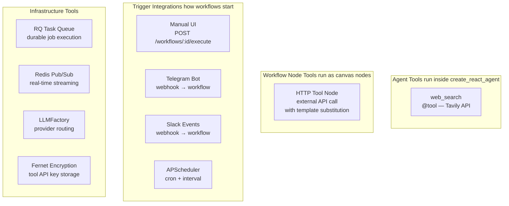

---

## 1. `web_search` — Tavily Search Tool

### 1a. Definition and internals

`@tool` gives the function a name and docstring the LLM reads to decide *when* to call it.
The raw `_do_web_search` function is separated so tests can call it directly without LangChain.

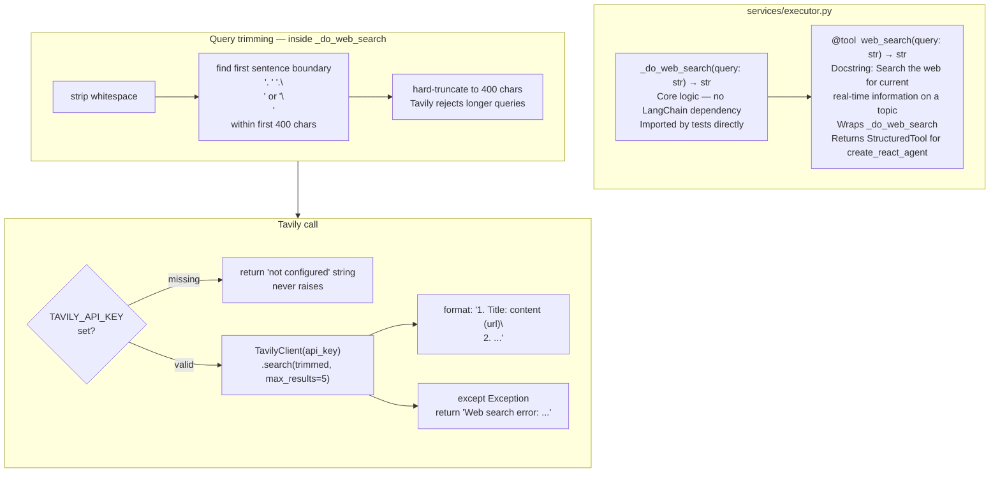

### 1b. Inside the ReAct loop

The LLM decides when to call `web_search` and may call it multiple times per task.

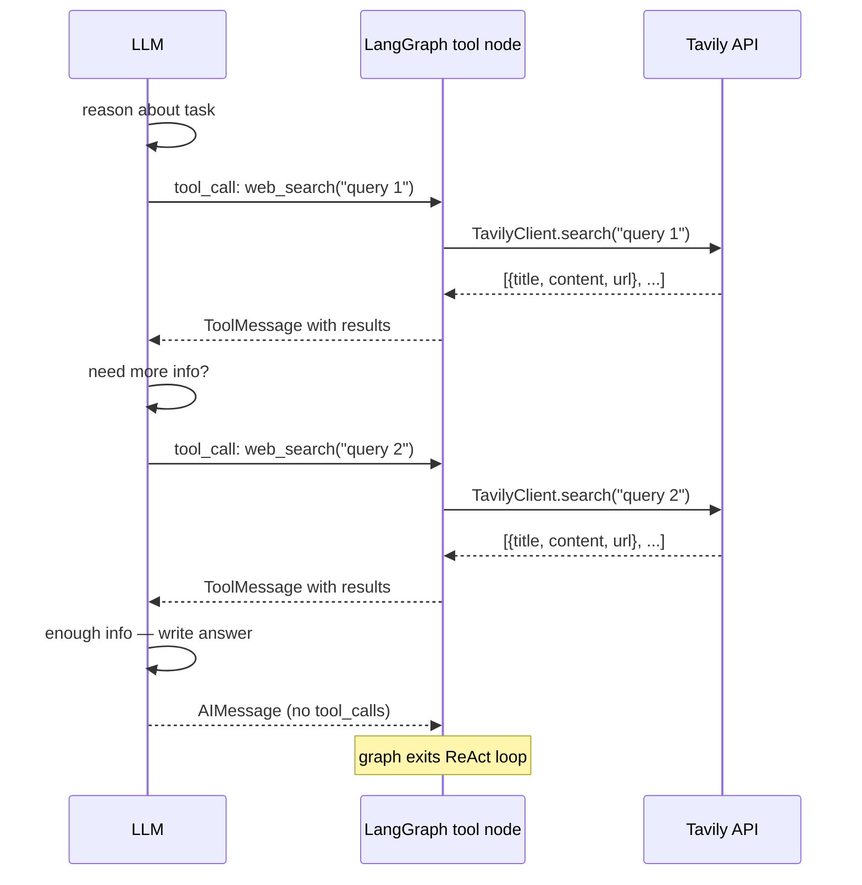

Token usage is summed across **all** LLM calls in the loop, not just the final one.

---

## 2. HTTP Tool Nodes — External API Calls

### 2a. Lifecycle

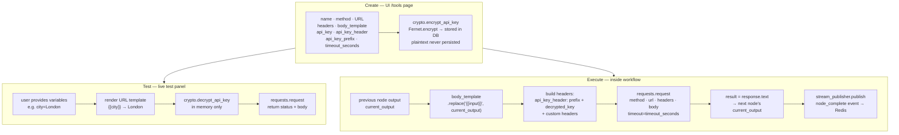

### 2b. API key masking rules

| Operation | What the API returns |
|---|---|
| `GET /tools` | `"••••••"` — always masked |
| `PUT /tools/:id` with `"••••••"` | existing key unchanged |
| `PUT /tools/:id` with new value | encrypt and overwrite |
| Test or workflow execution | decrypt in memory, inject into headers |

---

## 3. Trigger Integrations

### 3a. All four trigger sources

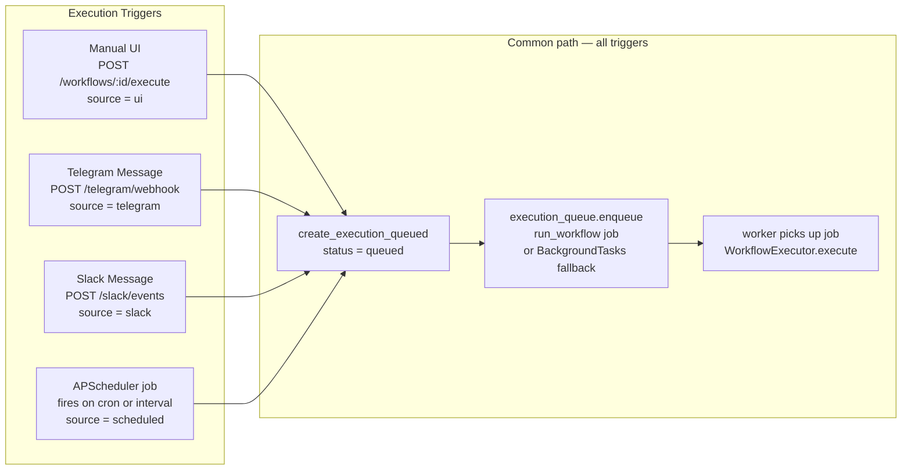

### 3b. Telegram Bot

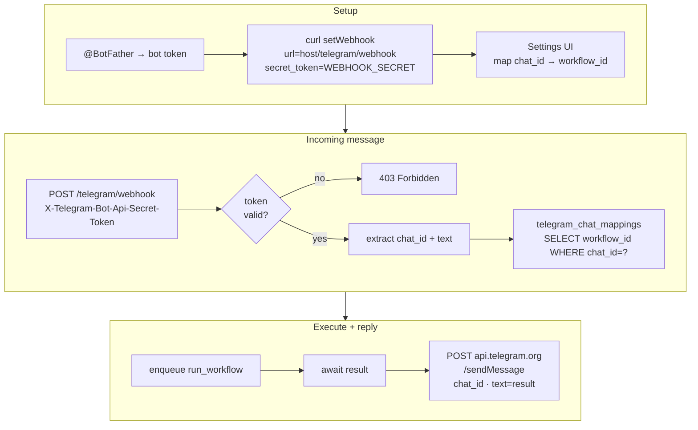

### 3c. Slack Events

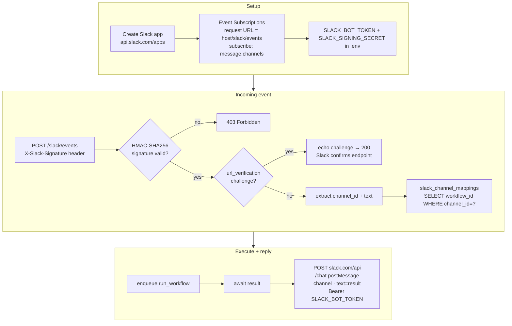

### 3d. APScheduler

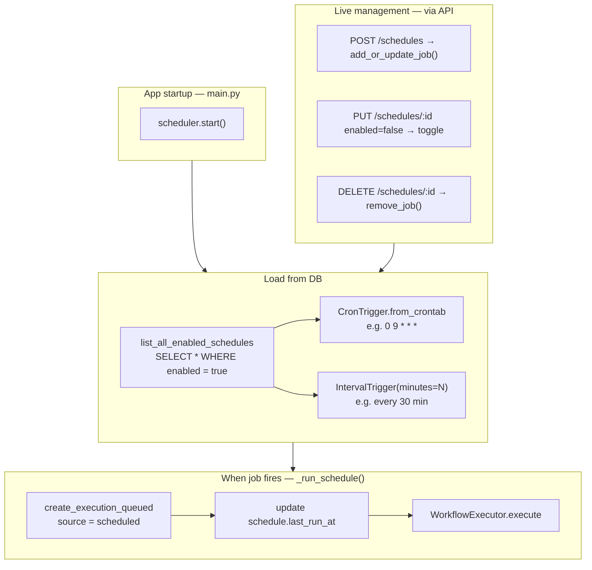

---

## 4. Infrastructure

### 4a. RQ Task Queue

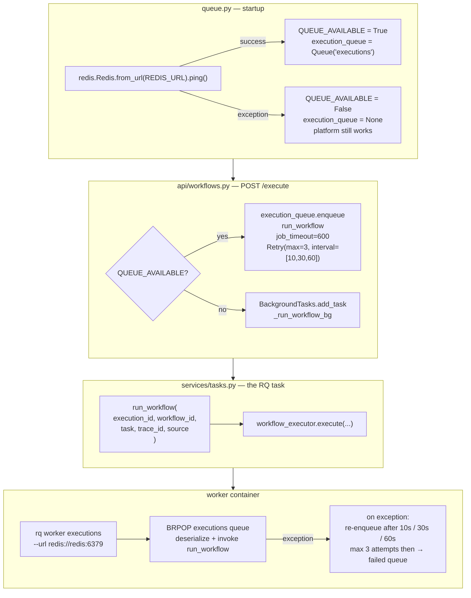

### 4b. Redis Pub/Sub — Streaming

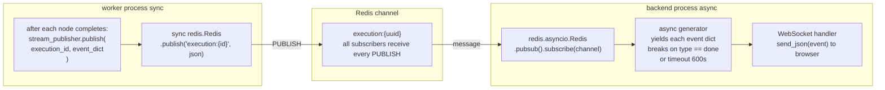

**Events published by the worker:**

| Event | Fields | When |
|---|---|---|
| `node_complete` | `node_id · output · tokens` | after each node finishes |
| `done` (success) | `result · node_outputs · tokens_used · cost · elapsed` | workflow complete |
| `done` (error) | `error` | workflow failed |

### 4c. LLM Provider Routing

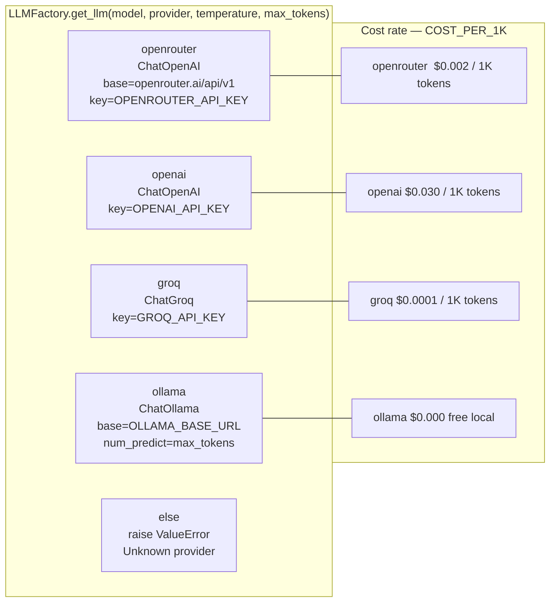

Token cost is computed after the ReAct loop ends by summing `token_usage.total_tokens` across every `AIMessage` in `response["messages"]`.

### 4d. Fernet Encryption — Tool API Keys

```mermaid
graph TD
    subgraph WRITE2["Write — POST or PUT /tools"]
        PT["plaintext key\ne.g. sk-abc123"]
        ENC2["Fernet.encrypt\nAES-128-CBC + HMAC-SHA256\nkey = TOOL_ENCRYPTION_KEY from .env"]
        STORED["encrypted bytes\nstored in tools.api_key column"]
        PT --> ENC2 --> STORED
    end

    subgraph READ2["Read — GET /tools"]
        ALWAYS["always return  '••••••'\nplaintext never in HTTP response"]
    end

    subgraph UPDATE2["Update — PUT /tools/:id"]
        SAME{"new value\n== '••••••'?"}
        KEEP["leave stored key unchanged"]
        REPLACE["encrypt new value → overwrite"]
        SAME -->|"yes"| KEEP
        SAME -->|"no"| REPLACE
    end

    subgraph USE2["Use — test or workflow execution"]
        DEC2["Fernet.decrypt\nin memory only"]
        INJ["inject into header:\napi_key_header: prefix + decrypted_key"]
        DEC2 --> INJ
    end

    subgraph ROTATE["Key rotation"]
        GEN2["python3 -c\n\"from cryptography.fernet import Fernet\nprint(Fernet.generate_key().decode())\""]
        WARN2["set TOOL_ENCRYPTION_KEY in .env\n⚠ existing stored keys become unreadable\nre-enter all tool API keys after rotation"]
        GEN2 --> WARN2
    end

    WRITE2 --> READ2
    WRITE2 --> UPDATE2
    WRITE2 --> USE2
```

---

## Quick Reference — Where Each Tool Lives

| Tool | File | Type |
|---|---|---|
| `web_search` | `services/executor.py` | `@tool` — LangChain StructuredTool |
| `_do_web_search` | `services/executor.py` | raw function — used by tests |
| HTTP Tool Node | `services/workflow_executor.py` → `_make_tool_node` | workflow canvas node |
| Telegram webhook | `api/telegram.py` + `services/telegram_handler.py` | FastAPI router |
| Slack webhook | `api/slack.py` | FastAPI router |
| APScheduler | `services/scheduler.py` | background thread in `backend` |
| RQ task | `services/tasks.py` + `services/queue.py` | executed by `worker` container |
| Redis streaming — publish | `services/stream_publisher.py` → `publish()` | sync — called from `worker` |
| Redis streaming — subscribe | `services/stream_publisher.py` → `subscribe_execution()` | async — called from `backend` |
| WebSocket endpoint | `api/execution_stream.py` | FastAPI WebSocket router |
| LLM routing | `services/executor.py` → `LLMFactory` | called from `AgentExecutor` |
| Fernet encryption | `services/crypto.py` | called from `api/tools.py` |
